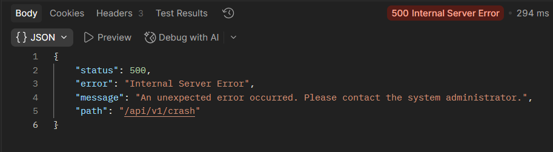

<div align="center">

</div>

<div align="center">

# 🏛️ Campus Sensor & Room Management API

### *A production-grade RESTful API powering the university's intelligent building infrastructure*

---


---

**Module:** 5COSC022W - Client-Server Architectures &nbsp;|&nbsp; **University of Westminster**
 &nbsp;|&nbsp; **Deadline:** 24th April 2026

**Student:** I.A. Sanara Nimsathi Perera &nbsp;|&nbsp; **IIT ID:** 20240773 &nbsp;|&nbsp; **UOW ID:** w2120118

</div>

---

## 🌐 What is this?
<div align="justify">
 
You have been appointed as the **Lead Backend Architect** for the university's *Smart Campus* initiative. What began as a pilot project tracking individual temperature sensors has evolved into a **comprehensive campus-wide infrastructure system**.

This API manages **thousands of Rooms** and the diverse array of **Sensors** deployed within them - CO2 monitors, occupancy trackers, smart lighting controllers - providing a seamless interface for campus facilities managers and automated building systems.

</div>
---

## ⚡ Quick Start

```bash
# 1. Clone the repository
git clone https://github.com/Sanara-Perera/Smart-Campus-API.git
cd Smart-Campus-API

# 2. Build the project (downloads all dependencies automatically)
mvn clean package

# 3. Launch the server
java -jar target/smart-campus-api-1.0.0.jar

# 4. Confirm it is alive
curl http://localhost:8080/api/v1/
```

> 🟢 **Server starts on** [http://localhost:8080/api/v1](http://localhost:8080/api/v1) - no external server required.
> 📦 **Pre-loaded with** 3 rooms, 5 sensors, and 3 sensor readings on every startup.

---

## 🗺️ API Architecture

```
http://localhost:8080/api/v1/
│
├── 🔍  GET  /                          → Discovery & HATEOAS links
│
├── 🏠  /rooms
│   ├── GET    /                        → List all rooms
│   ├── POST   /                        → Create a new room
│   ├── GET    /{roomId}                → Get room details
│   └── DELETE /{roomId}                → Delete room (blocked if sensors exist)
│
└── 📡  /sensors
    ├── GET    /                        → List all sensors
    ├── GET    /?type=CO2               → Filter sensors by type
    ├── POST   /                        → Register new sensor (validates roomId)
    ├── GET    /{sensorId}              → Get sensor details
    ├── DELETE /{sensorId}              → Remove sensor
    └── 📊  /{sensorId}/readings
        ├── GET  /                      → Full reading history
        ├── POST /                      → Record new measurement
        └── GET  /{readingId}           → Get single reading
```

---

## 🛠️ Technology Stack

| Layer | Technology | Purpose |
|---|---|---|
|  Language | Java 17 | Core application logic |
|  JAX-RS | Jersey 2.41 | REST framework (reference implementation) |
|  HTTP Server | Grizzly (embedded) | Lightweight server, zero configuration |
|  JSON | Jackson 2.15 | Java ↔ JSON serialisation |
|  Build | Apache Maven 3.9 | Dependency management and packaging |
|  Storage | ConcurrentHashMap | Thread-safe in-memory data store |

> ❌ **No Spring Boot.** ❌ **No Database.** ❌ **No external server.**
> ✅ Pure JAX-RS, exactly as required by the module specification.

---

## 📁 Project Structure

```
Smart-Campus-API/
├── 📄 pom.xml                          ← Maven build & dependency config
├── 📄 README.md                        ← You are here
├── 🖼️  banner.svg                       ← Animated README banner
└── src/main/java/com/smartcampus/api/
    │
    ├── 🚀 Main.java                    ← Entry point — starts Grizzly server
    ├── ⚙️  SmartCampusApplication.java  ← @ApplicationPath("/api/v1") config
    │
    ├── 📦 model/
    │   ├── Room.java                   ← id, name, capacity, sensorIds
    │   ├── Sensor.java                 ← id, type, status, currentValue, roomId
    │   ├── SensorReading.java          ← id, timestamp, value
    │   └── ErrorResponse.java          ← Standard JSON error shape
    │
    ├── 🗄️  store/
    │   └── DataStore.java              ← Singleton ConcurrentHashMap store
    │
    ├── 🌐 resource/
    │   ├── DiscoveryResource.java      ← GET /api/v1/ — HATEOAS discovery
    │   ├── RoomResource.java           ← Full room CRUD
    │   ├── SensorResource.java         ← Sensor CRUD + sub-resource locator
    │   └── SensorReadingResource.java  ← Reading history sub-resource
    │
    ├── ⚠️  exception/
    │   ├── ResourceNotFoundException.java        ← Triggers HTTP 404
    │   ├── RoomNotEmptyException.java             ← Triggers HTTP 409
    │   ├── LinkedResourceNotFoundException.java   ← Triggers HTTP 422
    │   └── SensorUnavailableException.java        ← Triggers HTTP 403
    │
    ├── 🗺️  mapper/
    │   ├── ResourceNotFoundExceptionMapper.java   ← → 404 Not Found
    │   ├── RoomNotEmptyExceptionMapper.java       ← → 409 Conflict
    │   ├── LinkedResourceNotFoundExceptionMapper  ← → 422 Unprocessable
    │   ├── SensorUnavailableExceptionMapper.java  ← → 403 Forbidden
    │   └── GlobalExceptionMapper.java             ← → 500 Safety net
    │
    └── 🔍 filter/
        └── LoggingFilter.java          ← Logs every request and response
```

---

## 🧪 Sample curl Commands

> Make sure the server is running before executing these commands.

### 🔍 1 - API Discovery
```bash
curl -X GET http://localhost:8080/api/v1/
```
```json
{
  "name": "Smart Campus Sensor & Room Management API",
  "version": "1.0.0",
  "contact": "admin@smartcampus.ac.uk",
  "_links": {
    "rooms": "http://localhost:8080/api/v1/rooms",
    "sensors": "http://localhost:8080/api/v1/sensors"
  }
}
```

---

### 🏠 2 - Create a Room
```bash
curl -X POST http://localhost:8080/api/v1/rooms \
  -H "Content-Type: application/json" \
  -d '{"id":"SCI-205","name":"Science Innovation Lab","capacity":40}'
```
```json
{ "id": "SCI-205", "name": "Science Innovation Lab", "capacity": 40, "sensorIds": [] }
```

---

### 📡 3 - Register a Sensor
```bash
curl -X POST http://localhost:8080/api/v1/sensors \
  -H "Content-Type: application/json" \
  -d '{"id":"CO2-002","type":"CO2","status":"ACTIVE","currentValue":0.0,"roomId":"SCI-205"}'
```

---

### 🔎 4 - Filter Sensors by Type
```bash
curl -X GET "http://localhost:8080/api/v1/sensors?type=Temperature"
```

---

### 📊 5 - Record a Sensor Reading
```bash
curl -X POST http://localhost:8080/api/v1/sensors/TEMP-001/readings \
  -H "Content-Type: application/json" \
  -d '{"value": 24.3}'
```

---

### ❌ 6 - Delete Room with Sensors (409 Conflict)
```bash
curl -X DELETE http://localhost:8080/api/v1/rooms/LIB-301
```
```json
{
  "status": 409,
  "error": "Conflict",
  "message": "Room LIB-301 cannot be deleted because it still has 2 sensor(s) assigned to it."
}
```

---

### 🚫 7 - Sensor with Invalid Room Reference (422)
```bash
curl -X POST http://localhost:8080/api/v1/sensors \
  -H "Content-Type: application/json" \
  -d '{"id":"X-001","type":"CO2","status":"ACTIVE","currentValue":0,"roomId":"FAKE-999"}'
```
```json
{
  "status": 422,
  "error": "Unprocessable Entity",
  "message": "Cannot create sensor: the referenced Room with id 'FAKE-999' does not exist."
}
```

---

### 🔧 8 - Post Reading to MAINTENANCE Sensor (403)
```bash
curl -X POST http://localhost:8080/api/v1/sensors/OCC-001/readings \
  -H "Content-Type: application/json" \
  -d '{"value": 15.0}'
```
```json
{
  "status": 403,
  "error": "Forbidden",
  "message": "Sensor OCC-001 is currently in 'MAINTENANCE' state and cannot accept new readings."
}
```
### 🛡️ 9 - Global Safety Net (500 - No Stack Trace Exposed)

```bash
curl -X GET http://localhost:8080/api/v1/sensors/CRASH-TEST
```

<div align="center">

</div>

> 🔒 The GlobalExceptionMapper catches all unexpected errors and returns a safe
> generic message - zero internal information is leaked to the client.
---

## 📋 Error Response Reference

Every error in this API returns a consistent JSON structure. No raw stack traces are ever exposed to the client.

```json
{
  "status": 404,
  "error": "Not Found",
  "message": "Room with id 'LIB-999' was not found.",
  "path": "/api/v1/rooms/LIB-999"
}
```

| Status | Error | Scenario |
|--------|-------|----------|
| `400` | Bad Request | Missing required fields in request body |
| `403` | Forbidden | Posting a reading to a sensor in MAINTENANCE |
| `404` | Not Found | Resource ID does not exist |
| `409` | Conflict | Deleting a room that still has sensors |
| `415` | Unsupported Media Type | Client sent non-JSON content |
| `422` | Unprocessable Entity | Sensor references a non-existent roomId |
| `500` | Internal Server Error | Unexpected server error  |

---

## 📝 Conceptual Report - Question Answers

---
<div align="justify">
 
### Part 1 - Service Architecture & Setup

**Question 1: Explain the default lifecycle of a JAX-RS Resource class. Is a new instance instantiated for every incoming request, or does the runtime treat it as a singleton? Elaborate on how this architectural decision impacts the way you manage and synchronize your in-memory data structures to prevent data loss or race conditions.**

By default, JAX-RS creates a new instance of each resource class for every incoming HTTP request. This is known as the **request-scoped lifecycle**. The runtime instantiates the resource class, uses it to handle the single request, produces a response, and then the instance is discarded by the garbage collector. This means resource classes are not shared between requests.

**Impact on in-memory data management:** Because each resource instance is freshly created per request, storing rooms or sensors as instance variables inside a resource class would cause all data to be lost the moment the request ends. To maintain persistent in-memory state across all requests, this implementation uses a **Singleton DataStore** - a single shared instance that lives for the entire lifetime of the server process. This is achieved using the Initialization-on-demand holder pattern, which is inherently thread-safe in Java without requiring explicit synchronization.

**Concurrency and thread safety:** Multiple HTTP requests can arrive simultaneously on different threads. Using a plain `HashMap` under concurrent access leads to race conditions and data corruption. This implementation uses `ConcurrentHashMap` for all storage maps, which handles concurrent reads and writes safely through internal lock striping. This prevents data loss and race conditions without requiring manual `synchronized` blocks, ensuring the API behaves correctly under concurrent load.

---

**Question 2: Why is the provision of Hypermedia (links and navigation within responses) considered a hallmark of advanced RESTful design (HATEOAS)? How does this approach benefit client developers compared to static documentation?**

**HATEOAS** (Hypermedia As The Engine Of Application State) is the principle that API responses should embed hyperlinks to related resources, enabling clients to navigate the API dynamically rather than relying on hardcoded URL knowledge. The discovery endpoint at `GET /api/v1/` demonstrates this by returning a `_links` object containing URLs for all primary resource collections.

**Benefits over static documentation:**

- **Self-documenting:** A new client can start at the root URL and discover the entire API by following links, just like a browser navigates a website without needing a sitemap. No prior knowledge of URLs is required.
- **Reduced coupling:** Clients that follow links rather than hardcode URLs automatically adapt if path structures change. No client-side code changes are needed when the API restructures a path.
- **State-driven navigation:** Advanced HATEOAS implementations include only links that are valid for the resource's current state, guiding clients toward valid operations only and preventing invalid requests.

This represents Level 3 - the highest level - of Richardson's REST Maturity Model, and is considered the hallmark of a truly mature RESTful API design.

---

### Part 2 - Room Management

**Question 1: When returning a list of rooms, what are the implications of returning only IDs versus returning the full room objects? Consider network bandwidth and client side processing.**

**Returning IDs only** (e.g., `["LIB-301", "LAB-101"]`) minimises the initial response payload size. However, this forces the client to make additional `GET /rooms/{id}` requests to retrieve details for each room - known as the **N+1 request problem**. Each additional round-trip introduces network latency, increasing total load time significantly, especially for mobile clients or slow connections.

**Returning full objects** (our implementation) produces a larger single response but provides the client with everything it needs in one round-trip. This eliminates follow-up requests entirely. At campus scale - hundreds of rooms rather than millions - the payload size is manageable, and the reduction in network round-trips significantly improves client performance. For very large datasets, pagination alongside full objects would be the appropriate solution, rather than returning IDs.

---

**Question 2: Is the DELETE operation idempotent in your implementation? Provide a detailed justification by describing what happens if a client mistakenly sends the exact same DELETE request for a room multiple times.**

Yes, **DELETE is idempotent** in this implementation. Idempotency means that making the same request multiple times produces the same server state - it does not mean the HTTP response code will be identical each time.

**Behaviour across multiple identical DELETE calls:**
- **First DELETE** of room `LIB-301`: room is found and removed - returns **200 OK**
- **Second DELETE** of room `LIB-301`: room no longer exists - returns **404 Not Found**

The end server state is identical after both calls - the room does not exist. The different response codes are correct and expected per the HTTP specification. This is important for reliability: a client that retries a DELETE after a network timeout can safely interpret both 200 and 404 as confirmation that the room is gone, without risk of accidental duplicate side effects.

---

### Part 3 - Sensor Operations & Linking

**Question 1: We explicitly use the @Consumes(MediaType.APPLICATION_JSON) annotation on the POST method. Explain the technical consequences if a client attempts to send data in a different format, such as text/plain or application/xml. How does JAX-RS handle this mismatch?**

The `@Consumes(MediaType.APPLICATION_JSON)` annotation declares that the POST method only accepts requests where the `Content-Type` header is `application/json`. If a client sends a request with `Content-Type: text/plain` or `Content-Type: application/xml`, JAX-RS intercepts the request **before it reaches the resource method** and automatically rejects it with:

- **HTTP 415 Unsupported Media Type** - the server understood the request but refuses to process the body format.

The resource method code never executes. This provides automatic input format validation at no cost, protecting the API from attempts to deserialise incompatible formats such as parsing a plain text string as a Java `Sensor` object. The mirror annotation `@Produces(APPLICATION_JSON)` works in the opposite direction - if a client sends `Accept: application/xml`, JAX-RS returns **HTTP 406 Not Acceptable**.

---

**Question 2: You implemented this filtering using @QueryParam. Contrast this with an alternative design where the type is part of the URL path (e.g., /api/v1/sensors/type/CO2). Why is the query parameter approach generally considered superior for filtering and searching collections?**

The implementation uses `GET /sensors?type=CO2` rather than `GET /sensors/type/CO2`. The query parameter approach is superior for the following reasons:

| Concern | Query Parameter | Path Segment |
|---|---|---|
| Optionality | `/sensors` works without any filter | `/sensors/type/` is broken without a value |
| Semantic accuracy | Filtering a collection - CO2 is a criterion | Implies CO2 is a unique identifiable resource |
| Composability | `?type=CO2&status=ACTIVE` composes cleanly | `/type/CO2/status/ACTIVE` is unreadable and order-dependent |
| REST convention | Industry-standard idiom for search and filter | Breaks path hierarchy semantics |

The REST principle is that URL path segments *identify resources* (e.g., `/rooms/LIB-301`). Query parameters *filter or modify* a collection. CO2 is a filter criterion, not a resource - it belongs in a query parameter, not a path segment.

---

### Part 4 - Deep Nesting with Sub-Resources

**Question 1: Discuss the architectural benefits of the Sub-Resource Locator pattern. How does delegating logic to separate classes help manage complexity in large APIs compared to defining every nested path in one massive controller class?**

The Sub-Resource Locator pattern, implemented in `SensorResource.getReadingResource()`, delegates the `/readings` path hierarchy to a dedicated `SensorReadingResource` class. This provides the following architectural benefits:

- **Single Responsibility Principle:** `SensorResource` is responsible for sensor CRUD operations. Reading history management is a separate concern owned by its own dedicated class. Each class has one clear purpose.
- **Manageability at scale:** Defining every nested path inside one massive controller produces hundreds of lines that become very difficult to navigate, debug, and maintain. Delegation keeps each class focused and concise.
- **Independent testability:** `SensorReadingResource` can be unit tested by constructing it directly with a known `sensorId`, with no parent resource wiring required.
- **Context encapsulation:** The `sensorId` is passed through the constructor, so every method in the sub-resource operates automatically within that sensor's context without needing to look it up repeatedly.
- **Reusability:** The `SensorReadingResource` could be returned by multiple parent locator methods with zero code duplication, if future resources also required reading history management.

---

### Part 5 - Advanced Error Handling, Exception Mapping & Logging

**Question 1: Why is HTTP 422 often considered more semantically accurate than a standard 404 when the issue is a missing reference inside a valid JSON payload?**

When a client POSTs a new sensor with `"roomId": "FAKE-999"` and that room does not exist, the correct response is **HTTP 422 Unprocessable Entity**, not 404, for the following reasons:

- **HTTP 404 Not Found** means: "The URL you requested does not exist." This is factually incorrect - the URL `/api/v1/sensors` is a perfectly valid, existing endpoint.
- **HTTP 422 Unprocessable Entity** means: "Your request arrived correctly, the URL is valid, the JSON is syntactically correct, but the data contains a semantic problem."

The problem is a **broken reference inside the request payload** - a referential integrity violation. The HTTP method is correct, the URL exists, and the JSON is well-formed. The issue is entirely semantic: the `roomId` field references a room that does not exist in the system. HTTP 422 precisely communicates to the client that they need to fix their data, not their URL - which is far more informative than a misleading 404 response.

---

**Question 2: From a cybersecurity standpoint, explain the risks associated with exposing internal Java stack traces to external API consumers. What specific information could an attacker gather from such a trace?**

Exposing raw Java stack traces to external API consumers is a serious cybersecurity vulnerability. An attacker can gather the following intelligence from a stack trace:

- **Technology fingerprinting:** Exact package names reveal the frameworks and library versions in use (e.g., `jersey:2.41`, `jackson:2.15`). The attacker cross-references these with public CVE databases to find known exploits for those exact versions.
- **Internal code structure:** Class names, method names, and line numbers reveal the application's internal architecture - which classes exist, how they relate, and where business logic is implemented.
- **File system paths:** Absolute file paths expose the server's directory structure, operating system type, deployment conventions, and sometimes usernames.
- **Business logic clues:** Method names such as `validateSensorBeforeSave()` reveal internal rules that can be deliberately targeted or bypassed.
- **Targeted exception attacks:** Knowing which exception was thrown and from which line, an attacker can craft specific inputs designed to repeatedly trigger that code path, potentially causing denial of service or bypassing validation logic.

The `GlobalExceptionMapper` in this implementation addresses this by catching all `Throwable` exceptions, logging the full stack trace server-side for developer debugging, and returning only a generic `"An unexpected error occurred"` message to the client - zero internal information is leaked to the outside world.

---

**Question 3: Why is it advantageous to use JAX-RS filters for cross-cutting concerns like logging, rather than manually inserting Logger.info() statements inside every single resource method?**

Logging is a **cross-cutting concern** - it applies uniformly to every endpoint regardless of what the endpoint does. Using JAX-RS filters rather than manual logging statements provides the following advantages:

- **Single point of control:** `LoggingFilter` is one class. Changing the log format, adding timestamps, or disabling logging entirely means editing one file, not hunting through dozens of resource methods.
- **Automatic coverage:** The filter is applied to every request and response by the JAX-RS framework. It is physically impossible to forget to add logging when a new endpoint is created.
- **Separation of concerns:** Resource methods focus purely on business logic. The filter handles the infrastructure concern of observability independently, keeping resource code clean and readable.
- **Composability:** Additional filters such as authentication, rate limiting, and CORS headers can be added as separate classes without touching any resource method.
- **DRY Principle:** Manual `Logger.info()` calls in every resource method duplicate the same boilerplate code across every endpoint, violating the Don't Repeat Yourself principle. A filter eliminates all duplication.

This is the same principle behind middleware in Express.js, interceptors in Spring, and decorators in Python frameworks - cross-cutting concerns must be kept separate from business logic for maintainable, scalable API design.

</div>

---

<div align="center">

---

```
Built with ☕ Java  |  🏛️ University of Westminster  |  5COSC022W Client-Server Architectures
```

**I.A. Sanara Nimsathi Perera** &nbsp;|&nbsp; IIT ID: 20240773 &nbsp;|&nbsp; UOW ID: w2120118


</div>
